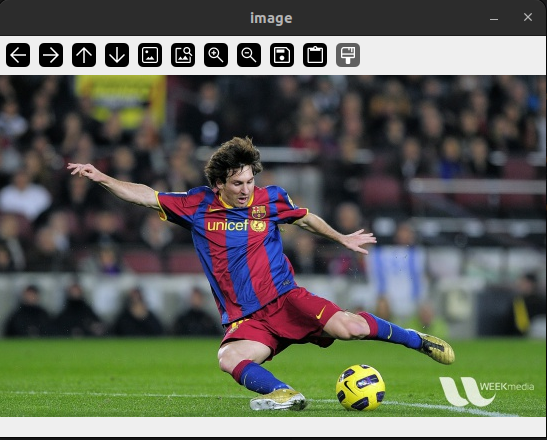
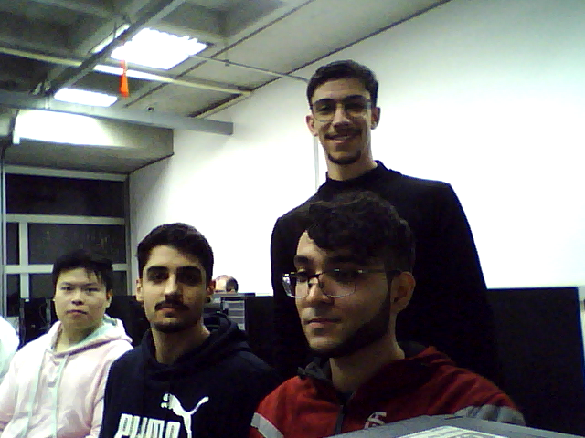

## Respostas do Laboratório 1 - Captura de Imagem e Vídeo
**ESZA019 – Visão Computacional**

**Membros do grupo:**

> - Ian Victor Toniolo Silva - 11202020351
> - Cesar Seiji Maruyama - 11127015
> - Pedro Henrique Cardoso Silva - 11202021250
> - Guilherme de Sousa Santos - 11201921175

**Data de realização dos experimentos:**
- 18/06/2025 (quarta-feira)

**Data de publicação do relatório:**
- 25/06/2025 (quarta-feira)

### INTRODUÇÃO
> O presente relatório tem como objetivo documentar as atividades realizadas no **Laboratório 1 - Captura de Imagem e Vídeo** da disciplina de Visão Computacional, abordando conceitos fundamentais relacionados à captura e manipulação de imagens e vídeos. Durante os experimentos, foram explorados aspectos práticos do uso da biblioteca OpenCV, como leitura, exibição, gravação e processamento básico de imagens e vídeos.

> Neste relatório, serão descritas as etapas realizadas para manipular imagens e vídeos, incluindo a leitura de arquivos, captura de frames de câmeras, ajustes de parâmetros como taxa de quadros (FPS) e operações básicas de processamento. Além disso, serão apresentados os resultados obtidos, como fotos e vídeos capturados durante os experimentos realizados também em laboratório, e discutidas as observações feitas ao longo do processo.

---

### PARTE 1: Processamento Básico nas Imagens e Vídeos

**(A) Leitura de imagem em arquivo**
> A janela não mostra a imagem colorida pois o segundo parâmetro da função `cv.imread()` foi atribuído o valor `0`, que representa ausência de cor no modo de leitura. Caso a atribuição seja `cv.IMREAD_COLOR_BGR` a imagem será convertida para os canais RBG (Red-Blue-Green) e a saída será uma imagem colorida.
>
> Para corrigir isso, basta alterar a linha de leitura da imagem para:

```python
img = cv.imread('messi5.jpg',cv.IMREAD_COLOR_BGR)
```
> Dessa forma, a imagem será lida corretamente com as cores e apresentada na janela da seguinte forma:



**Como reproduzir?**
> 1. Certifique-se de ter o Python instalado em sua máquina, juntamente com a biblioteca OpenCV (`pip install opencv-python`).
> 2. Salve a imagem `messi5.jpg` no mesmo diretório do script Python.
> 3. Crie um arquivo Python com o seguinte código:
   ```python
    import numpy as np
    import cv2 as cv

    img = cv.imread('messi5.jpg',cv.IMREAD_COLOR_BGR)
    cv.imshow('image',img)
    k = cv.waitKey(0)
    if k == 27:         # wait for ESC key to exit
        cv.destroyAllWindows()
    elif k == ord('s'): # wait for 's' key to save and exit
        cv.imwrite('messigray.png',img)
        cv.destroyAllWindows()
   ```
> 4. Execute o script e observe a imagem colorida sendo exibida na janela.

---

**(B) Leitura de vídeo em arquivo**
> A velocidade de exibição do vídeo, ou seja, a velocidade com que os frames são exibidos na tela depende do tempo de espera entre a exibição de cada frame, controlado pela linha `time.sleep(1/25.0)` (simula um atraso de 40ms).

> Para aumentar a velocidade, basta diminuir o tempo de espera através de um acréscimo no valor do denomidador. Por exemplo, se quisermos aumentar para 50fps, basta fazer a seguinte alteração:

```python
time.sleep(1/50.0)
```

> Para reduzir a velocidade, basta aumentar o tempo de espera. Por exemplo, se quisermos diminuir para 10fps, basta fazer a seguinte alteração:

```python
time.sleep(1/10.0)
```

**Como reproduzir?**
> 1. Certifique-se de ter o Python e a biblioteca OpenCV instalados.
> 2. Salve o vídeo que deseja exibir no mesmo diretório do script Python.
> 3. Crie um arquivo Python com o seguinte código:
   ```python
    import time
    import numpy as np
    import cv2 as cv

    cap = cv.VideoCapture('big_buck_bunny.mp4')

    while(cap.isOpened()):
        ret, frame = cap.read()
        
        if ret==True:
            # show the frame
            cv.imshow('frame',frame)

            #wait next frame by 40ms - 25fps
            time.sleep(1/25.0) 
            
            if cv.waitKey(1) & 0xFF == ord('q'):
                break
        else:
            break
                  
    cap.release()
    cv.destroyAllWindows()
   ```
> 4. Substitua `'big_buck_bunny.mp4'` pelo nome do arquivo de vídeo.
> 5. Ajuste o valor de `time.sleep()` para alterar a velocidade de exibição do vídeo.
> 6. Execute o script e observe o vídeo sendo exibido na janela.

---

**(C) Leitura de imagem de câmera**
> Para salvar o frame ao pressionar a tecla 'x', basta adicionar o seguinte comando:

```python
if key == ord('x'):
    cv.imwrite('foto1.png', frame)
    print("Frame saved as 'foto1.png'")
```

**Como reproduzir?**
> 1. Certifique-se de ter uma câmera conectada ao computador.
> 2. Crie um arquivo Python com o seguinte código:
   ```python
    import numpy as np
    import cv2 as cv

    cap = cv.VideoCapture(2)

    if not cap.isOpened():
        print("Cannot open camera")
        exit()
        
    while True:
        # Capture frame-by-frame
        ret, frame = cap.read()
        # if frame is read correctly ret is True
        if not ret:
            print("Can't receive frame (stream end?). Exiting ...")
            break
        
        # Display the resulting frame
        cv.imshow('frame', frame)
        
        key = cv.waitKey(1)
        
        # Save then frame when 'x' is pressed
        if key == ord('x'):
            cv.imwrite('foto1.png', frame)
            print("Frame saved as 'foto1.png'")
            
        # Break the loop when 'q' is pressed
        if key == ord('q'):
            print("Exiting...")
            break

    # When everything done, release the capture
    cap.release()
    cv.destroyAllWindows()
   ```
> 3. Execute o script e pressione 'x' para salvar o frame ou 'q' para sair.
> 4. A imagem será salva como `foto1.png` no mesmo diretório do script.

---

**(D) Gravação de vídeo da câmera**
> Para que a saída do vídeo esteja "normal", ou seja, sem a inversão vertical e com uma velocidade adequada, basta remover o comando `cv.flip(frame, 0)` que inverte a imagem verticalmente e ajustar o valor da variável `fps` para um valor mais alto, como `60.0`, que é uma taxa de quadros comum para vídeos.

**Como reproduzir?**
> 1. Certifique-se de ter uma câmera conectada ao computador.
> 2. Crie um arquivo Python com o seguinte código:
   ```python
   import numpy as np
import cv2 as cv

cap = cv.VideoCapture(2)

# Get current width of frame
width = cap.get(cv.CAP_PROP_FRAME_WIDTH)   # float
# Get current height of frame
height = cap.get(cv.CAP_PROP_FRAME_HEIGHT) # float
# Define Video Frame Rate in fps
fps = 60.0

# Define the codec and create VideoWriter object
fourcc = cv.VideoWriter_fourcc(*'XVID')
out = cv.VideoWriter('saida.avi', fourcc, fps, (int(width),int(height)) )

while cap.isOpened():
    ret, frame = cap.read()
    if not ret:
        print("Can't receive frame (stream end?). Exiting ...")
        break
    # write the flipped frame
    out.write(frame)
    cv.imshow('frame', frame)
    if cv.waitKey(1) == ord('q'):
        break

# Release everything if job is finished
cap.release()
out.release()
cv.destroyAllWindows()
   ```
> 3. Execute o script e pressione 'q' para encerrar a gravação.
> 4. O vídeo será salvo como `saida.avi` no mesmo diretório do script.

---

**Responda: se for necessário alterar a imagem, ou seja realizando alguma operação de procesamento nela, em que ponto dos quatro programas estudados isso deve ser realizado?**
> As operações de processamento de imagem devem ser realizadas após a leitura da imagem ou do frame do vídeo, mas antes de exibi-los ou salvá-los.

---

### PARTE 2: Obtenção de Fotos e Vídeos

**(A) Obtenção de foto da equipe**



**(B) Foto Avatar da equipe**

**(C) Vídeos com pessoas e com objeto**

> O seguinte vídeo foi gravado com uma pessoa realizando movimentos rápidos com as mãos:

<video width="320" height="240" controls>
  <source src="./video-pessoa-rapido.mp4" type="video/mp4">
  Your browser does not support the video tag.
</video>

> O seguinte vídeo foi gravado com uma pessoa realizando movimentos lentos com as mãos:

<video width="320" height="240" controls>
  <source src="./video_pessoa_lento.mp4" type="video/mp4">
  Your browser does not support the video tag.
</video>

> O seguinte vídeo foi gravado com um objeto (uma garrafa) realizando movimentos rápidos:

<video width="320" height="240" controls>
  <source src="./objeto_rapido_garrafa.mp4" type="video/mp4">
  Your browser does not support the video tag.
</video>


> O seguinte vídeo foi gravado com um objeto (uma garrafa) realizando movimentos lentos:

<video width="320" height="240" controls>
  <source src="./objeto_lento_garrafa.mp4" type="video/mp4">
  Your browser does not support the video tag.
</video>

---

### Análise

Neste laboratório, o foco foi a captura e manipulação de imagens e vídeos utilizando a biblioteca OpenCV. Ao longo dos experimentos, foi abordado diversos aspectos práticos que envolveram a leitura, exibição, gravação e processamento básico de arquivos de imagem e vídeo. E cada etapa contribuiu para uma melhor compreensão das funções da OpenCV e da também a interação com arquivos de mídia.

Na parte de processamento de imagens e vídeos, foi possível realizar ajustes fundamentais nos scripts do roteiro, como a leitura de imagens em diferentes formatos, alteração da taxa de quadros (FPS) em vídeos e a captura de frames em tempo real de uma câmera. A experimentação com a manipulação de vídeos mostrou a importância de controlar a taxa de quadros, que impacta diretamente na fluidez, sendo possível ajustar a velocidade de reprodução com base em configurações como time.sleep() pra controlar a captura de novos frames. E também foi possível realizar a inversão vertical dos frames com uma correção pela simples remoção do comando cv.flip().

A parte prática do laboratório foi um exercício de aplicação de conceitos teóricos, como a manipulação de objetos do tipo cv.VideoCapture e cv.VideoWriter para capturar e salvar vídeos. Além disso, os experimentos envolvendo movimentos rápidos e lentos mostraram as diferenças na captura e na percepção do movimento, enfatizando a importância de um bom controle da taxa de quadros para capturar detalhes em vídeos com movimentos rápidos.

### Conclusão

Por fim, este laboratório permitiu a aplicação prática de conceitos de Visão Computacional relacionados à captura, exibição, gravação e processamento básico de imagens e vídeos. Através dos experimentos que foram realizados, e assim foi possível observar os efeitos da taxa de quadros na reprodução de vídeos e como ajustes simples no código podem alterar significativamente a qualidade da captura e exibição das imagens e vídeos.

A experiência também revelou a importância de entender a arquitetura e os parâmetros da OpenCV, como o controle do FPS, a leitura de arquivos e a gravação em tempo real.

Essas atividades foram fundamentais para o desenvolvimento de habilidades e analise no âmbito de Visão Computacional e abrem portas para experimentos mais complexos, como o processamento de vídeos em tempo real, detecção de objetos e movimento, e outros algoritmos aplicados a fluxos de imagens e vídeos. A experiência prática, aliada ao conhecimento teórico adquirido, fortalece a base necessária para projetos futuros na área.

---

### REFERÊNCIAS
- OpenCV Documentation: https://docs.opencv.org/
- OpenCV Python Tutorials: https://opencv-python-tutroals.readthedocs.io