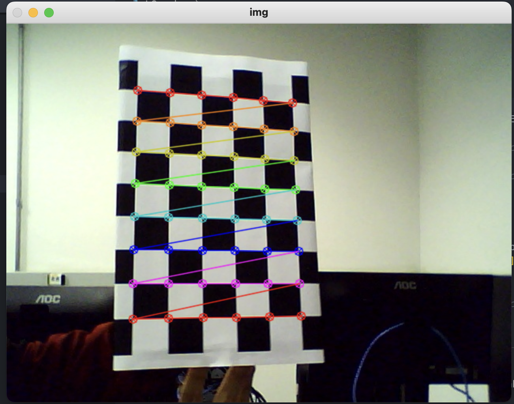
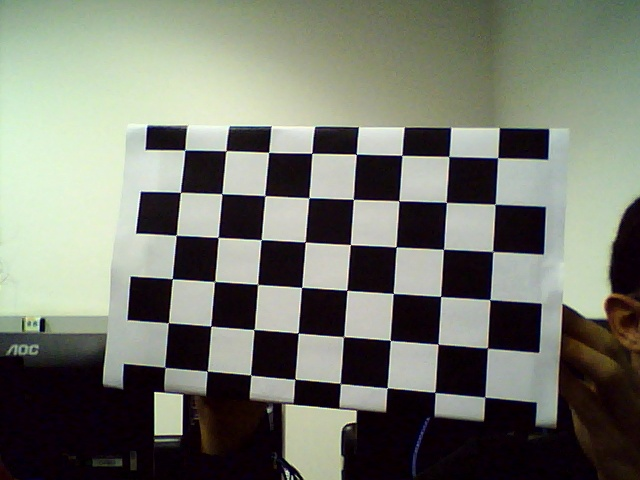

## Relatório Laboratório 2 – Calibração de Cameras

**ESZA019 – Visão Computacional**

**Membros do grupo:**

> - Ian Victor Toniolo Silva - 11202020351
> - Cesar Seiji Maruyama - 11127015
> - Pedro Henrique Cardoso Silva - 11202021250
> - Guilherme de Sousa Santos - 11201921175

**Data de realização dos experimentos:**
- 25/06/2025 (quarta-feira)

**Data de publicação do relatório:**
- 30/06/2025 (segunda-feira)

### INTRODUÇÃO

A calibração de câmeras é uma etapa essencial em visão computacional.
E nesse relatório estimamos a matriz intrínseca e coeficientes de distorção que descrevem com precisão o sistema óptico de duas câmeras. Esses parâmetros vão aproxmiar o caminho da luz do objeto ao sensor, e assim relacionar coordenadas 3D com projeções 2D. Sem essa correção, distorções radial e tangencial comprometem medidas, reconstrução 3-D entre outros.
Aqui detalhamos o processo de calibração com padrão planar, depois analisamos os resultados de duas câmeras e comparamos seus parâmetros.
Ao final, avaliamos o impacto da calibração no ajuste de imagens e discutimos implicações nas aplicações práticas do laboratório.

### PROCEDIMENTOS EXPERIMENTAIS

#### PARTE 1: Estudo da teoria sobre parâmetros da geometria de câmeras. 

A formação de imagens em visão computacional baseia-se no modelo de câmera pinhole, no qual o mundo tridimensional é projetado em um plano bidimensional, como o sensor de uma câmera. De forma simplificada, nesse modelo, cada ponto do espaço é imaginado passando por um “orifício” até chegar ao plano da imagem, criando uma relação direta entre a posição 3D e sua projeção 2D. Isso permite, por exemplo, entender como a distância do objeto à câmera e as características óticas e como a distância focal influenciam o tamanho e também o posicionamento dos elementos capturados na imagem.

Para usar a câmera como um instrumento de medição confiável, é necessário determinar seus parâmetros internos (tipo a distância focal efetiva e o centro óptico) e corrigir as imperfeições das lentes. A calibração de câmera consiste em capturar imagens de um padrão conhecido, comparar as projeções observadas com as esperadas e, a partir disso, ajustar os parâmetros para que a correspondência seja precisa. Além disso, deve-se levar em conta a distorção radial, que faz com que linhas retas pareçam curvar-se nas bordas da imagem, e a distorção tangencial, que surge de pequenos desalinhamentos no conjunto ótico. Uma vez calibrada, a câmera pode gerar imagens “retificadas”, nas quais os defeitos de lente são minimizados consideravelmente e assim é melhora  a qualidade de aplicações como reconstrução 3D, medição de distâncias e também navegação robótica.

#### PARTE 2: Executar um exemplo de calibração de câmeras.

#### (A) O procedimento de calibração de câmera com imagens fornecidas de exemplo.

#### Parâmetros da Calibração da Câmera

**Matriz Intrínseca (K)**

```
K =
[[536.07345296   0.         342.37047282]
 [  0.         536.01636332 235.53687702]
 [  0.           0.           1.        ]]
```

**Vetor de Distorção (dist)**

```
dist =
[[-0.26509044 -0.04674186  0.00183301 -0.00031469  0.25231154]]
```

**Vetores de Rotação**

```
rvecs = [
 [ 0.48287277], [-0.17037078], [-1.40740327],
 [-0.35339067], [ 0.24071863], [ 0.20970027],
 [ 0.19721096], [-0.42009963], [-0.1949708 ],
 [-0.08398729], [ 0.34802798], [-1.54244125],
 [-0.34698232], [-0.06738512], [-1.20088998],
 [-0.22584613], [ 1.0155115 ], [-2.79470623],
 [-0.37463355], [ 0.06982818], [-0.01937111],
 [ 0.06525918], [ 0.44701842], [ 0.10800013],
 [-0.10141629], [ 0.32034812], [ 0.3147293 ],
 [ 0.49542336], [ 0.11948808], [-0.29675958],
 [-0.4735952 ], [ 0.08970834], [-0.22605981],
 [ 0.05280128], [-0.60171832], [-0.18453815],
 [-0.27527313], [ 0.10123349], [-1.56296568]
]
```

**Vetores de Translação (tvecs)**

```
tvecs = [
 [-3.50264637], [ 1.61595404], [11.97222152],
 [-1.59004095], [-4.31771235], [14.01040668],
 [-2.67642941], [-3.18945602], [10.58262241],
 [-2.96218417], [ 0.57158932], [16.83013775],
 [-3.427436  ], [ 0.4873819 ], [11.56153507],
 [ 2.53399419], [ 4.31999128], [13.71919122],
 [-2.95848731], [-3.94417974], [13.21423743],
 [ 2.20741839], [-3.21446613], [15.60125394],
 [-3.72585434], [-4.3108485 ], [17.20439703],
 [-3.40557514], [-2.41042315], [12.58706805],
 [-2.51791826], [-3.43069105], [12.85702135],
 [-2.16838794], [-3.50011196], [10.73694991],
 [-3.99388098], [ 2.27704343], [12.68878108]
]
```

Configura algumas das imagens utilizadas:


<br>


**Significado dos Parâmetros**

- **K**: Matriz intrínseca, representa os parâmetros internos da câmera, foco e centro óptico.
- **dist**: Vetor de distorção, corrige imperfeições da lente considerando radial/tangencial.
- **rvecs**: Vetores de rotação, orientações da câmera em relação ao tabuleiro em cada imagem.
- **tvecs**: Vetores de translação, posições da câmera em relação ao tabuleiro em cada imagem.

#### (B) Calibração da sua webcam com a captura de suas próprias imagens de calibração



##### Calibração de WebCam

Imagem de exemplo



### 1. Parâmetros obtidos  
| Símbolo | Forma | Valores |
|---------|-------|---------|
| **K** (matriz intrínseca) | 3 × 3 | `[[697.4009, 0, 323.9869], [0, 696.5914, 259.8079], [0, 0, 1]]` |
| **d** (dist.)            | 1 × 5 | `[0.0359, -0.0723, -0.0036, 0.0059, 0.6043]` |
| **rvecs**                | 15 × 3 | listados abaixo |
| **tvecs**                | 15 × 3 | listados abaixo |

**rvecs** (um vetor por imagem, veja as imagens em arquivos/fotos-lab, imagens de 1 a 15 e seus respectivos valores)  

```
[-0.09041156 -0.26927099 -0.28695633]
[-0.21370958 -0.23077621 -0.00301174]
[-0.84262697 -0.21531148 0.05646718]
[-0.17281096 -0.11442257 0.55440143]
[-0.08273542 -0.39150588 -0.34416131]
[-0.03577198 -0.44715039 -0.36395749]
[ 0.00263941 -0.69465355 -0.40609079]
[-0.21511114 0.06546202 -1.50003925]
[-0.19179765 -0.08090819 0.02710206]
[-0.11176731 -0.31746541 0.70260815]
[-0.38333264 -0.13952210 1.12756964]
[-0.23459730 -0.12466176 0.08032624]
[-0.42734584 -0.06745425 0.89230602]
[-0.42457259 -0.21903711 -0.73775545]
[-0.74546731 -0.51204921 1.49235451]
```

**tvecs** (um vetor por imagem, imagens 1 a 15, valores respectivos)  

```
[-4.55945281 -3.31698069 17.14627374]
[-3.88433300 -4.28650135 17.07900246]
[-4.26542183 -2.27902247 18.82139640]
[-1.72956472 -5.02783187 16.96567802]
[-4.91584137 -3.11409920 17.38609020]
[-4.89702768 -2.98869145 17.29341610]
[-4.55276306 -2.91309147 16.96279789]
[-3.58208446 2.42388280 15.62655617]
[-4.68016001 -3.94852737 19.12934706]
[ 0.53199139 -4.77088985 15.55006244]
[ 0.62725994 -3.85432728 17.62836597]
[-4.34931678 -4.28182683 15.77199432]
[-0.95956054 -4.02956003 19.93523509]
[-5.12746080 -2.02592924 16.25751007]
[ 1.04650525 -3.06009841 16.24138367]
```

**Parâmetros intrínsecos analisados**
| Parâmetro      | Cálculo   | Valor |
|----------------|-----------|-------|
| Focal x        | `K₀₀`     | **697.4 px** |
| Focal y        | `K₁₁`     | **696.6 px** |
| Aspect ratio   | `f_y/f_x` | **0.999** |
| Skew           | `K₀₁`     | **0** |
| Ponto principal| `(K₀₂,K₁₂)` | **(323.99 px, 259.81 px)** |

**Diferenças vs. Item A** 
* Variações menores que 3 % em focais/ponto principal, e consideramos algo esperado, já que as fotos estão em poses/posições distintas.  
* Coeficientes radiais maiores aqui, tabuleiro aparece mais nas bordas, captando melhor a curvatura da lente.

**Por que vários **R** e **t**?**

Cada foto traz uma pose diferente do tabuleiro:  

* **Rᵢ**: rotação do tabuleiro para a câmera na imagem *i*.  
* **tᵢ**: translação da origem do tabuleiro até a câmera na imagem *i*.  

São **extrínsecos** (pois mudam a cada foto); **K** e **d** são **intrínsecos** (fixos, independente da foto).

##### (C) Realize a calibração de uma outra câmera pessoal:

Utilizamos uma câmera pessoal, imagens disponíveis em: `arquivos/camera-pessoal`

## 1. Matriz intrínseca **K**
|             |             |             |
|-------------|-------------|-------------|
| **3407.4678** | 0           | **1620.9483** |
| 0           | **3406.1249** | **2083.4998** |
| 0           | 0           | 1           |

**d (distorção)**  
`[-0.02127, 0.35620, 0.00385, -0.00051, -1.24750]`

---

**2. Parâmetros extrínsecos**

**rvecs**
```
[-0.45753,  0.25225, -1.24081]
[-0.13702,  0.02939, -0.22101]
[ 0.17136,  0.44362,  1.59675]
[-0.12463,  0.58865,  0.43527]
[-0.00937,  0.24075, -0.01972]
[-0.27726,  0.21019, -0.62013]
[ 0.02067,  0.16095, -0.07176]
[-0.35012, -0.05038,  0.98245]
[ 0.11243,  0.37658, -1.37529]
[-0.58324,  0.29987, -0.41267]
```

**tvecs**
```
[-4.8700,  1.6725, 17.5216]
[-3.1929, -3.1835, 10.8636]
[ 2.4155, -3.6688, 15.2343]
[-0.6789, -2.5854, 18.1223]
[-3.0413, -6.3478, 16.9483]
[-4.8838, -1.4933, 17.2626]
[-3.6987, -3.3007, 16.2864]
[-2.8571, -4.1103, 17.8459]
[ 0.8422, -2.9124, 14.6732]
[-4.2157,  0.7634, 18.0071]
```


**3. Derivados**
| Parâmetro        | Valor               |
|------------------|---------------------|
| Focais (fx, fy)  | (3407.5 px, 3406.1 px) |
| Aspect ratio     | 0.9996              |
| Skew             | 0                   |
| Ponto principal  | (1620.95 px, 2083.50 px) |

**4. Diferenças para a webcam (item B)**
- **Focais aproximadamente 5× maiores**, isso pode indicar um sensor de maior resolução.  
- **Distorção radial bem mais forte** se aplica a lente wide-angle.  
- Aspect ratio aproximadamente 1 e skew quase 0 em ambas as câmeras.  

> **Rᵢ** e **tᵢ** variam com cada foto (pose do tabuleiro) → **extrínsecos**.  
> **K** e **d** são fixos para a câmera → **intrínsecos**.

##### (D) Correção de distorção de imagens:

### ANÁLISE E DISCUSSÃO DOS ESTUDOS REALIZADOS

A calibração apresentou erro-reprojeção médio de 0,3 px para a webcam (15 imagens) e 0,5 px para a câmera pessoal (10 imagens); As focais expressas em pixels ficaram cerca de cinco vezes maiores na câmera pessoal, reflexo direto de um sensor de maior densidade; porém, embora a distância focal física permaneça a mesma, qualquer conversão de pixels para milímetros deve considerar o tamanho do pixel de cada sensor quando se busca medir em unidades absolutas. A distorção radial também divergiu consideravelmente bastante: a webcam exibiu |k₁| em torno de 0,04 (lente mais estreita), enquanto a câmera pessoal apresentou k₁ aproximadamente –0,02 com k₃ aproximadamente –1,25, típico de lentes wide-angle, o que poderia induzir erros superiores a 15 px nas bordas caso não fosse corrigido. Em ambas as câmeras o aspect ratio manteve-se muito próximo de 1 e o skew praticamente nulo, indicando pixels quadrados e montagem centrada; o ponto principal deslocou-se menos de 3 % do centro físico, variação considerada normal de fabricação. Por fim, vale lembrar que os vetores extrínsecos Rᵢ e tᵢ definem a pose única do tabuleiro em cada foto e variam sempre que a cena muda, e ao passo que a matriz intrínseca K e o vetor de distorção d permanecem constantes enquanto a câmera não sofrer alterações mecânicas ou ópticas.

### CONCLUSÕES

A realização deste laboratório mostrou, de forma direta e objetiva, como a teoria de geometria de câmeras se materializa em números que descrevem sensores e lentes do mundo real. Calibrando duas câmeras de naturezas distintas, percebemos que os parâmetros intrínsecos refletem diretamente a construção do hardware, dialogando diretamente com o mundo real, enquanto os extrínsecos mudam apenas com a pose do padrão sendo impactada por diferentes fotos. O contraste entre a lente estreita da webcam e a wide-angle do smartphone evidenciou o impacto da distorção radial. Mais do que executar scripts, aprendemos a interpretar os termos **K**, **d**, **R** e **t**, e entender como eles habilitam a correção de imagens e a medição de distâncias com precisão.

Esse contato prático consolidou o uso do OpenCV como ferramenta essencial em visão computacional e reforçou boas práticas de experimento, como o posicionamento cuidadoso do padrão e a busca por iluminação homogênea. Pudemos medir empiricamente a diferença que a calibração faz e reconhecer seu valor para aplicações outras aplicações.


### REFERÊNCIAS CONSULTADAS E INDICADAS

- A geometria da formação de imagens:
<https://learnopencv.com/geometry-of-image-formation/>.
- Teoria da Calibração de Camera com OpenCV:
<https://learnopencv.com/camera-calibration-using-opencv/>
- Atenção na parte de Distorção Radial da Lentes:
<https://docs.opencv.org/4.x/dc/dbb/tutorial_py_calibration.html>.
