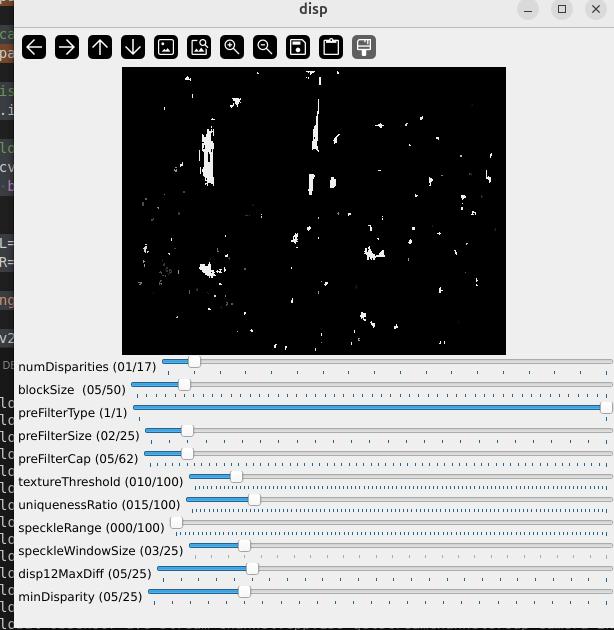
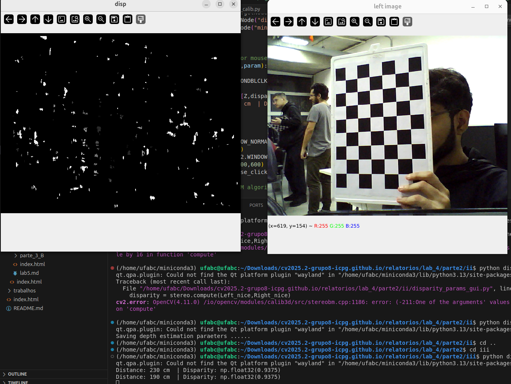
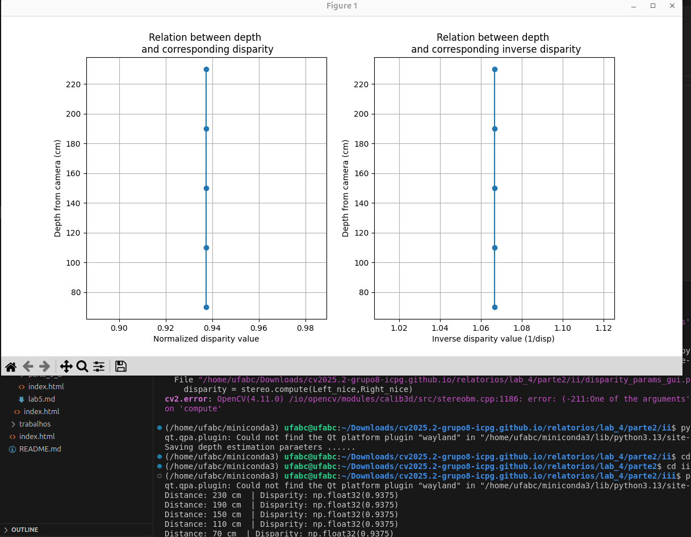
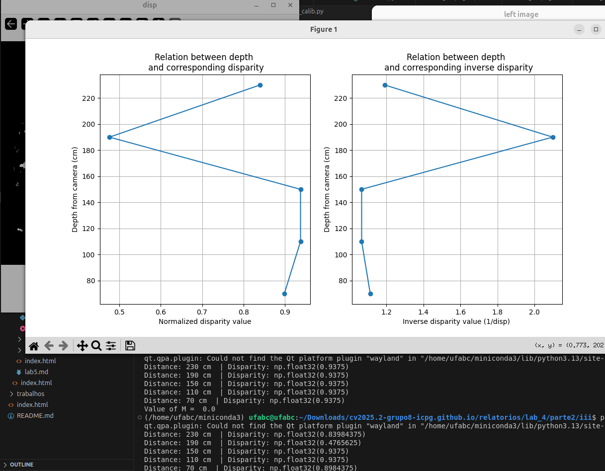
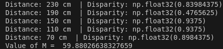
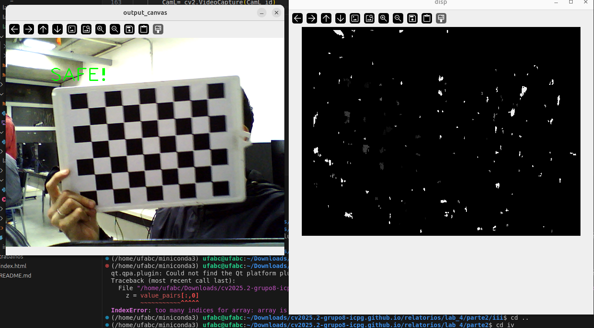
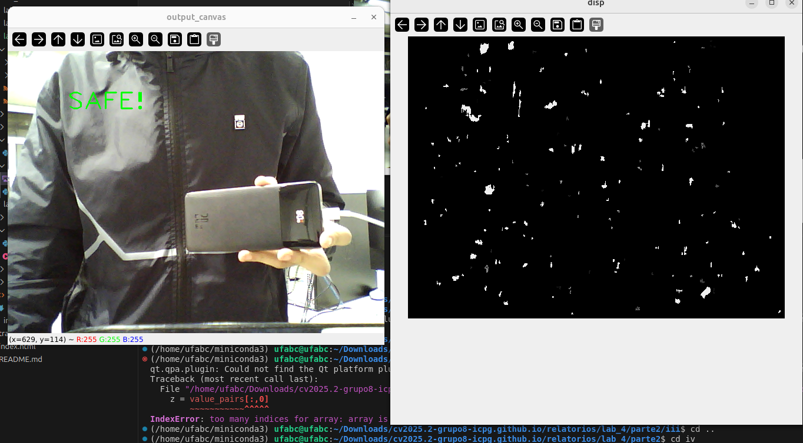
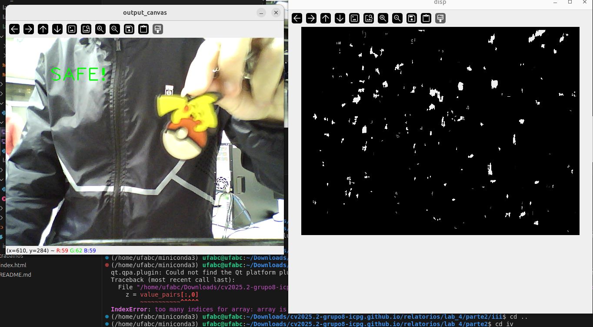

## Relatório Laboratório 4 – Mapa de Profundidade

**ESZA019 – Visão Computacional**

**Membros do grupo:**

> - Ian Victor Toniolo Silva - 11202020351
> - Cesar Seiji Maruyama - 11127015
> - Pedro Henrique Cardoso Silva - 11202021250
> - Guilherme de Sousa Santos - 11201921175

**Data de realização dos experimentos:**
- 02/07/2025 (quarta-feira)

**Data de publicação do relatório:**
- 21/07/2025 (segunda-feira)

## Introdução

Neste laboratório, nosso objetivo foi complementar o sistema de câmera estéreo construído no último lab, usando as duas webcams. Ao longo do relatório, vamos mostrar o passo a passo de como calibramos essas câmeras, geramos um "mapa de disparidade" para comparar as imagens e, finalmente, o transformamos em um mapa de profundidade (objetivo principal). Para isso, utilizamos principalmente a biblioteca OpenCV.

## Procedimentos experimentais – explicando como realizar e executar as atividades

#### PARTE 1: Estudo da teoria sobre estereoscopia e parâmetros conjuntos de duas câmeras, e também sobre processo de mapeamento de disparidade entre duas cameras. Estudar detalhadamente os seguintes itens:

- Estude aqui a geometria epipolar com duas cameras/imagens[2]: <https://learnopencv.com/introduction-to-epipolar-geometry-and-stereo-vision/>.

- Estude a formação do Mapa de Profundidade com Par de Imagens Estéreo: Depth Map from Stereo Images [4]: <https://docs.opencv.org/4.x/dd/d53/tutorial_py_depthmap.html>.

- Estude aqui o Mapa de Disparidade com OpenCV [3] com Câmeras: <https://learnopencv.com/depth-perception-using-stereo-camera-python-c/>

#### PARTE 2: Utilizar a câmera estereoscopica construída na aula anterior.

##### i. Calibração estéreo

A calibração de câmeras consiste em estimar os parâmetros intrínsecos e extrínsecos de uma ou mais câmeras com base em imagens de um padrão conhecido, como um tabuleiro de xadrez. A calibração é essencial para corrigir distorções nas imagens capturadas pela câmera, além de ajudar a determinar as relações espaciais entre as câmeras em um sistema estéreo como o utilizado em laboratório.

Primeiro, capture as imagens executando o seguinte arquivo Python dentro da pasta `parte2/i/`:

```shell
python3 capture_images.py
```

As imagens serão salvas dentro das pastas `parte2/data/stereoL` e `parte2/data/stereoR`.

Em seguida, execute o seguinte arquivo Python para a calibração das câmeras:

```shell
python3 calibrate.py
```

Os parâmetros de calibração serão salvos no arquivo `params_py.xml` dentro da pasta `parte2/data/`, que serão usados na próxima etapa.

##### ii. Mapa de disparidade

O mapa de disparidade é uma imagem que representa a diferença de posição horizontal (disparidade) entre pontos correspondentes em duas imagens capturadas por uma câmera estéreo. Essa disparidade é diretamente relacionada à profundidade dos objetos na cena: quanto maior a disparidade, mais próximo está o objeto da câmera.

Execute o algoritmo Block Matching do OpenCV (`StereoBM`) através do seguinte arquivo Python:

```shell
python3 disparity_params_gui.py
```

Esse programa vai:
- Inicializar as duas webcams para captura de imagem estéreo
- Fazer a leitura dos parâmetros de calibração gerados na etapa anterior (arquivo XML)
- Criar uma janela GUI (Figura 1) com barras de rastreamento para ajustar os parâmetros da visão estéreo interativamente
- Capturar frames das câmeras e calcular o mapa de disparidade usando o algoritmo `StereoBM`
- Salvar os parâmetros no arquivo XML (`parte2/ii/depth_estmation_params_py.xml`)

<figure>
    
    <figcaption>Figura 1. Janela par ajuste dos parâmetros da visão estéreo.</figcaption>
</figure>

##### iii. Mapa de profundidade

O mapa de profundidade é uma imagem em escala de cinza onde cada pixel representa a distância entre a câmera e os objetos da cena naquele ponto. Para obtê-lo a partir do mapa de disparidade, execute o programa Python:

```shell
python3 disparity2depth_calib.py
```

Esse programa é responsável pela calibração do mapa de profundidade a partir do mapa de disparidade usando as câmeras estéreos. A relação entre a disparidade (`x-x'`) e a profundidade `Z` segue a seguinte equação:

`disparity=x-x'=Bf/Z`,

onde `B` corresponde à linha de base da configuração da câmera estéreo e `f` é o fator de focal da câmera.

As etapas do código são descritas a seguir:

- Inicializar as duas webcams para captura de imagem estéreo.
- Fazer a leitura dos parâmetros de calibração gerados na etapa 1 (`params_py.xml`).
- Carregar os parâmetros `StereoBM` a partir do arquivo `depth_estmation_params_py.xml`.
- Interagir com o mouse (double click) para regitrar os valores de disparidade em pontos específicos no mapa de disparidade (Figura 2).

<figure>
    
    <figcaption>Figura 2. Mapa de disparidade e o respectivo frame capturado pela câmera.</figcaption>
</figure>

- Calcular o mapa de disparidade usando o algoritmo `StereoBM` a partir das imagens estéreo capturadas e retificadas.
- Coletar os pares profundidade-disparidade através da interação do usuário e plotar na tela (Figuras 3 e 4).

<figure>
    
    <figcaption>Figura 3. Relação entre a profundidade e a disparidade correspondente.</figcaption>
</figure>

<figure>
    
    <figcaption>Figura 4. Relação entre a profundidade e a disparidade correspondente.</figcaption>
</figure>

- Usar o ajuste mínimo de quadrados para calcular o fator `M`. Esse fator é usado para converter os valores de disparidade em profundidades (Figura 5).

<figure>
    
    <figcaption>Figura 5. Cálculo do fator M.</figcaption>
</figure>

- Salvar os parâmetros estéreo no arquivo `depth_estmation_params_py.xml`.

##### iv. Medidas de distância

Para metrificar a distância é utilizado o conceito de "Evitação de obstáculos" (_obstacle avoidance_), que determina se a distância de qualquer objeto da câmera estéreo é mais próximo que o limiar mínimo de distância.

As etapas para criar um sistema de _obstacle avoidance_ são descritas a seguir:

- Carregar os parâmetros de calibração da câmera estéreo a partir do arquivo gerado na etapa 1 (`params_py.xml`)
- Acessar o mapa de profundidade da câmera estéreo a partir do arquivo gerado na etapa anterior (`depth_estmation_params_py.xml`)
- Baseado em um limiar (valor de profundidade mínimo), determinar as regiões do mapa de profundidade com um valor de profundidade menor do que o limiar. Usando o método `inRange()`, criar uma máscara para segmentar essas regiões.
- Aplicar a detecção de contorno e encontrar o maior contorno.
- Criar uma nova máscara usando o maior contorno.
- Calcular a pronfudidade média usando o método `meanStdDev()` a partir da máscara criada na etapa anterior.
- Executar uma ação de alerta para indicar a distância do obstáculo com uma cor vermelha.

Execute o seguinte código Python para obter o sistema de _obstacle avoidance_:

```shell
python3 obstacle_avoidance.py
```

O principal método deste arquivo é o `obstacle_avoid()`, responsável por detectar e alertar sobre obstáculos baseado no mapa de profundidade. Se nenhum obstáculo significativo é detectado, o código exibe uma mensagem de `SAFE!` na tela, como pode ser observado nas seguintes figuras:

<figure>
    
    <figcaption>Figura 6. Detecção de obstáculo para objeto 1.</figcaption>
</figure>

<figure>
    
    <figcaption>Figura 7. Detecção de obstáculo para objeto 2.</figcaption>
</figure>

<figure>
    
    <figcaption>Figura 8. Detecção de obstáculo para objeto 3.</figcaption>
</figure>

##### v. Medidas de distância

## Análise e discussão dos estudos realizados

Ao longo dos experimentos, pudemos entender na prática como a visão estéreo funciona. O primeiro passo, a **calibração das câmeras**, se mostrou fundamental. Sem ela, as pequenas distorções das lentes e o desalinhamento entre as câmeras gerariam erros em todos os cálculos seguintes. A calibração corrige essas imperfeições e nos dá os parâmetros exatos para alinhar as imagens.

Com as câmeras calibradas, passamos para o **mapa de disparidade**. A ideia aqui é simples: um objeto próximo parece "pular" mais de uma imagem para a outra do que um objeto distante. O mapa de disparidade mostra exatamente esse "pulo" (a disparidade) para cada ponto da imagem. Nas nossas imagens, as áreas com maior disparidade (mais claras) representavam os objetos mais próximos.

A etapa seguinte foi transformar essa disparidade em uma **medida real de profundidade (distância)**. Usando a relação matemática `disparidade = Bf/Z`, onde `B` é a distância entre as câmeras e `f` é a distância focal, conseguimos calcular a profundidade `Z`. O experimento nos guiou para encontrar um fator de conversão `M`, que simplifica esse cálculo e nos permite criar um mapa de profundidade, onde cada pixel indica uma distância em vez de uma cor.

Por fim, aplicamos esse conhecimento em um sistema de **desvio de obstáculos**. Ao definir uma distância mínima, o programa conseguia analisar o mapa de profundidade e alertar quando um objeto estava perto demais, colorindo a região de vermelho.

## Conclusões

Este laboratório nos permitiu exercitar o que vimos nas aulas teóricas e concluir que é totalmente viável construir um sistema de visão estéreo funcional com materiais simples, como duas webcams, e ferramentas de software acessíveis como o OpenCV. Conseguimos realizar com sucesso todas as etapas do projeto, desde a montagem e calibração do sistema até a geração de mapas de profundidade e sua aplicação em um caso de uso prático.

Aprendemos que a precisão do sistema depende muito da qualidade da calibração e das condições de iluminação do ambiente. Pequenos erros no início podem levar a medições de distância imprecisas no final. Mesmo assim, após os desafios de fazer o sistema funcionar, ele foi capaz de medir distâncias e identificar obstáculos de forma consistente.

## Referências consultadas e indicadas

[1] Making A Low-Cost Stereo Camera Using OpenCV:
<https://learnopencv.com/making-a-low-cost-stereo-camera-using-opencv/>
Código:
<https://github.com/spmallick/learnopencv/tree/master/stereo-camera>

[2] Introduction to Epipolar Geometry and Stereo Vision:
<https://learnopencv.com/introduction-to-epipolar-geometry-and-stereo-vision/>
Código:
<https://github.com/spmallick/learnopencv/tree/master/EpipolarGeometryAndStereoVision>

[3] Stereo Camera Depth Estimation With OpenCV (Python/C++):
<https://learnopencv.com/depth-perception-using-stereo-camera-python-c/>
Código:
<https://github.com/spmallick/learnopencv/tree/master/Depth-Perception-Using-StereoCamera>

[4] Depth Map from Stereo Images:
<https://docs.opencv.org/4.x/dd/d53/tutorial_py_depthmap.html>

[5] C. Loop and Z. Zhang. Computing Rectifying Homographies for Stereo Vision. IEEE Conf.
Computer Vision and Pattern Recognition, 1999.

[6] Geometry of Image Formation:
<https://learnopencv.com/geometry-of-image-formation/>