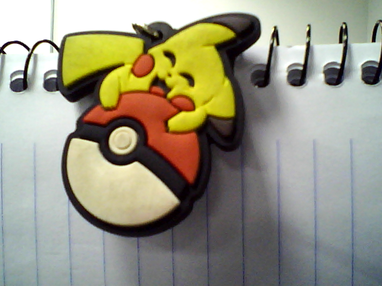
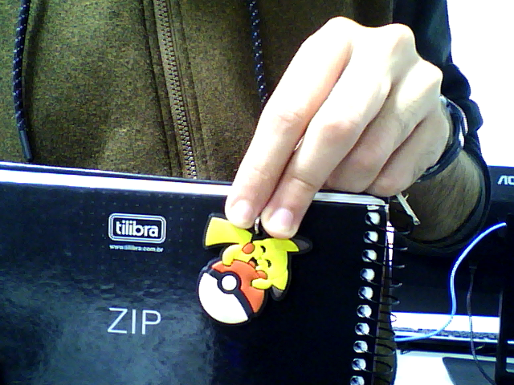
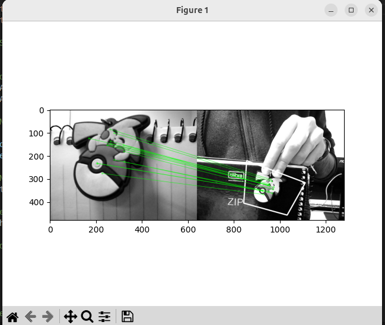

## Relatório Laboratório 5 – Extração de Características (Features)

**ESZA019 – Visão Computacional**

**Membros do grupo:**

> - Ian Victor Toniolo Silva - 11202020351
> - Cesar Seiji Maruyama - 11127015
> - Pedro Henrique Cardoso Silva - 11202021250
> - Guilherme de Sousa Santos - 11201921175

**Data de realização dos experimentos:**
- 02/07/2025 (quarta-feira)

**Data de publicação do relatório:**
- 21/07/2025 (segunda-feira)

## Introdução

## Procedimentos experimentais – explicando como realizar e executar as atividades

### Passo 1: Configuração do Ambiente

Certifique-se de que você tenha as bibliotecas necessárias instaladas:

```python
pip install opencv-python opencv-python-headless numpy matplotlib
```

### Passo 2: Captura da Imagem com a Webcam (capture_image.py)

Utilize o código capture_image.py que captura uma imagem usando a webcam e a salva como box_in_scene.png. O código já está correto,  a imagem é salva como `object_in_scene.png`. Mas você pode renomea-la. Para executar a extração de features, vamos precisar de uma imagem mais simples com o objeto a ser detectado e uma imagem do objeto na cena. Execute o capture_image.py para capturar as imagens necessárias e renomeie conforme o necessário.

Vamos usar como exemplos as seguintes imagens:

#### Objeto



#### Objeto na cena



### Passo 3: Realizar a Correspondência de Características e Homografia (feature_matching.py)

O código em `parte_2/feature_matching.py` compara duas imagens (uma contendo o objeto e outra com o objeto na cena) e usa o método SIFT para encontrar os pontos de correspondência, o que o código faz:

1. Carregar as Imagens:
    O código já carrega object.png (a imagem do objeto) e object_in_scene.png (a imagem capturada da cena).

2. Detectar e Computar os Descritores das Imagens:
    Usando o SIFT (Scale-Invariant Feature Transform), são detectados os pontos-chave e descritores das imagens.

3. Correspondência de Características com FLANN:
    As correspondências entre os descritores das duas imagens são encontradas usando o algoritmo FLANN (Fast Library for Approximate Nearest Neighbors).

4. Aplicar Lowe’s Ratio Test:
    O critério de Lowe é aplicado para garantir que apenas as correspondências de alta qualidade sejam selecionadas.

5. Calcular a Homografia:
    Usando o método cv.findHomography(), o código calcula a transformação geométrica que alinha as duas imagens com base nas correspondências encontradas.

6. Desenhar o Polígono de Correspondência:
    O código desenha um polígono na imagem da cena para mostrar onde o objeto foi encontrado.

Execute-o com `python3 feature_matching.py`. Você deve obter um resultado similar a isso:



## B) Elaborar outro programa OpenCV, modificando o codigo acima, para fazer a leitura de duas webcams da camera estereoscópica calibrada, mostrando o resultado em video.

## Análise e discussão dos estudos realizados

## Conclusões

## Referências consultadas e indicadas

 
